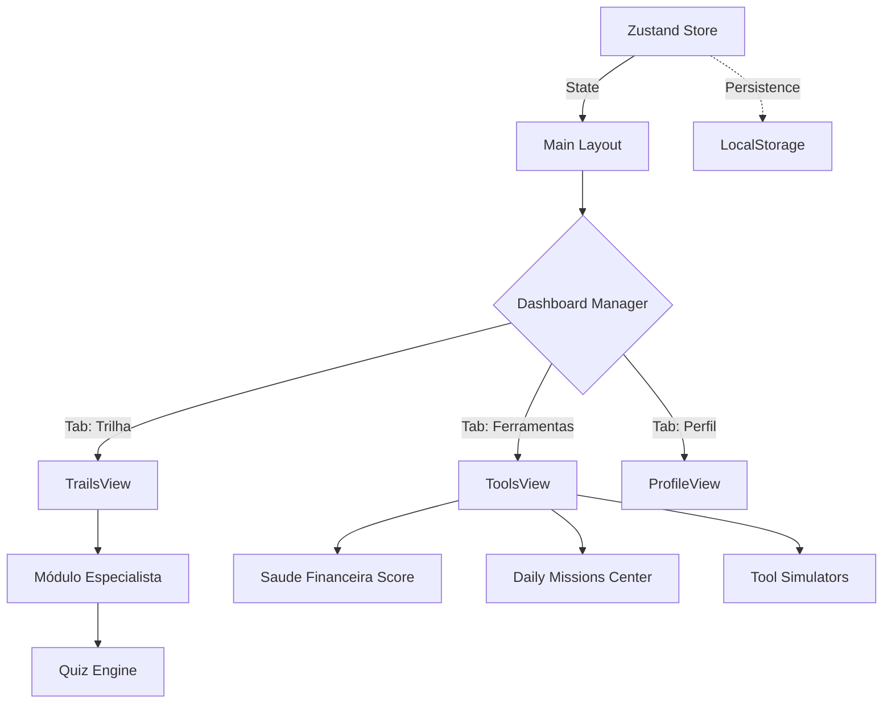

# 💎 Kapitalia — Educação Financeira Gamificada

[](https://nextjs.org/)
[](https://www.typescriptlang.org/)
[](https://tailwindcss.com/)
[](https://zustand-demo.pmnd.rs/)

**Kapitalia** é uma plataforma de educação financeira inspirada na dinâmica do Duolingo. O objetivo é transformar o aprendizado de finanças (muitas vezes árido e complexo) em uma jornada interativa, visualmente atraente e recompensadora, movida por XP, níveis e missões práticas.

---

## 🎯 "North Star" do Projeto
Tornar a alfabetização financeira acessível e viciante através de um ecossistema que une **teoria (Trilhas de Aprendizado)** e **prática (Laboratório Financeiro)**.

---

## 🏗️ Arquitetura do Sistema

O projeto utiliza um padrão de **Single-View Manager** no Next.js, onde o estado global orquestra a navegação fluida entre lições, ferramentas e perfil sem recarregamentos pesados.



---

## ✨ Funcionalidades Principais

### 🎓 1. Trilhas Conceptuais (Estudo)
- **Pedagogia Study → Practice:** Cada lição é composta por uma fase teórica profunda seguida por desafios práticos.
- **Módulo de Especialista:** Dicas consolidadas de especialistas financeiros integradas ao fluxo de preparação.
- **Categorias:** Renda Fixa, Ações e Bolsa (PRO), Cripto (PRO) e Básico Financeiro.

### 🧪 2. Laboratório Financeiro (Prática)
- **Simuladores de Mercado:** Estratégias de orçamento (50/30/20, 25/25/25/25), Juros Compostos, Tesouro e Projeção de Ações.
- **Input Mode Moderno:** Entradas otimizadas para mobile e sistema anti-erro de digitação.

### 🎮 3. Motor de Gamificação
- **Saúde Financeira Score:** Uma nota de 0 a 100 baseada na saúde real dos dados do usuário + bônus de nível (XP).
- **Módulos de Recompensa:** Ganho de XP em tempo real ao realizar simulações e concluir lições.
- **Streak & Hearts:** Sistema de persistência diária e "vidas" para manter o engajamento.

---

## 🛠️ Stack Tecnológica
- **Core:** Next.js 15 (App Router) + React 19.
- **Estilização:** Tailwind CSS 4.0 + Lucide Icons.
- **Estado Local/Global:** Zustand com persistência em cache.
- **Animações:** Framer Motion & Tailwind Animate.
- **UI Components:** Shadcn/UI (Radix Primitives).

---

## 🚀 Como Rodar localmente

### Requisitos
- Node.js 18+ instalado.

### Passo 1: Instale as dependências
```bash
npm install
```

### Passo 2: Inicie o servidor de desenvolvimento
```bash
npm run dev
```
O projeto estará rodando em `http://localhost:3000`.

---

## 📂 Estrutura de Pastas
```text
kapitalia/
├── app/               # Rotas e Views principais (Router dinâmico local)
├── components/        # Componentes UI (Shadcn e customizados)
├── hooks/             # Middlewares de interação UI
├── lib/               # Lógica de Negócio (Zustand Store e MockData)
│   ├── store.ts       # O cérebro do Kapitalia
│   └── types/         # Definições de API e Modelos
└── public/            # Assets, Icones e Imagens
```

---

## ⚠️ Variáveis de Ambiente
O projeto atualmente roda em modo **Mock-First**, o que significa que não requer variáveis de ambiente secretas para execução local básica. Planos futuros incluem integração com Bancos via Open Finance (requereria API_KEY).

---
> [!TIP]
> **Dica de Desenvolvimento:** O cérebro do app reside em `lib/store.ts`. Qualquer alteração na lógica de XP ou progresso deve ser feita através das ações definidas no Zustand.
